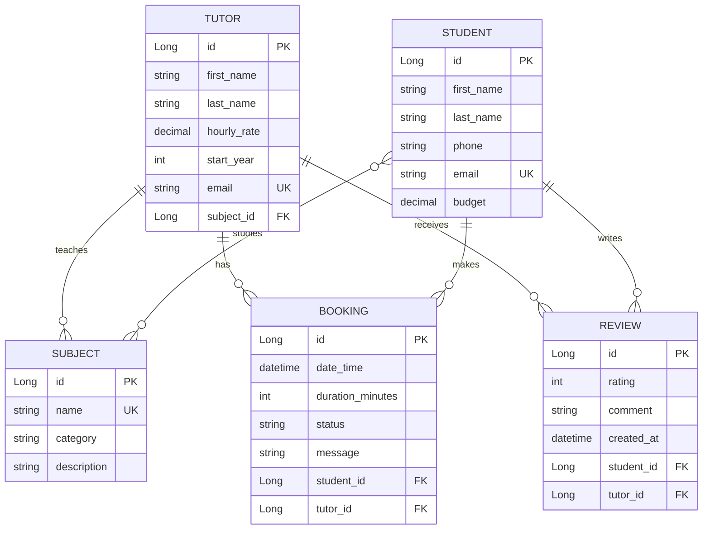

# TUTOR PLATFORM

### REST API проект на Java, фреймворк Spring, Maven. Платформа для поиска и бронирования занятий с репетиторами. 

1. Подготовить Dockerfile для приложения.
2. Подготовить Docker Compose (приложение + БД).
3. Использовать переменные окружения.
4. Разместить приложение на бесплатном хостинге (PaaS).
5. Настроить CI/CD в GitHub:
- сборка
- тесты
- развертывание
- healthcheck

## Технологический стек

- **Java 21**
- **Spring Boot 4.0.3**
- **Spring Web / Validation / Data JPA / AOP / Actuator**
- **PostgreSQL 17**
- **Maven**
- **Lombok**
- **springdoc-openapi (Swagger UI)**
- **React 18 / TypeScript 5 / Ant Design**
- **Docker + Docker Compose**
- **JaCoCo + Checkstyle + SonarCloud**

# Быстрый старт

### Вариант 1: запуск через Docker Compose (рекомендуется)

    
```bash
docker compose up --build
```

После запуска доступны:
- API: `http://localhost:8080`
- Swagger UI: `http://localhost:8080/swagger-ui.html`
- Health check: `http://localhost:8080/actuator/health`

---

### Вариант 2: локальный запуск (без Docker)

1) Поднять PostgreSQL и создать БД `tutor_db`.

2) Указать переменные окружения (или оставить дефолты).

3) Запустить приложение:

```bash
mvn spring-boot:run
```

---

##  Переменные окружения

| Переменная | По умолчанию | Назначение |
|---|---:|---|
| `APP_PORT` | `8080` | Порт приложения |
| `SPRING_APPLICATION_NAME` | `tutor-platform` | Имя сервиса |
| `SPRING_DATASOURCE_URL` | `jdbc:postgresql://localhost:5432/tutor_db` | URL БД |
| `SPRING_DATASOURCE_USERNAME` | `postgres` | Пользователь БД |
| `SPRING_DATASOURCE_PASSWORD` | `your_password` | Пароль БД |
| `SPRING_JPA_HIBERNATE_DDL_AUTO` | `update` | Стратегия схемы |
| `SPRING_JPA_SHOW_SQL` | `true` | Логирование SQL |
| `REACT_APP_API_URL` | `http://localhost:8080/api` | URL API для фронтенда |

---

## API overview

Базовые группы endpoint’ов:

- `GET/POST/PUT/DELETE /api/tutors`
- `GET/POST/PUT/DELETE /api/students`
- `GET/POST/PUT/DELETE /api/subjects`
- `GET/POST/PUT/DELETE /api/bookings`
- `GET/POST/PUT/DELETE /api/reviews`
- `POST /api/async/tutors/update-rates`
- `GET /api/async/tasks/{taskId}`
- `GET /api/race-condition/demo`

Полная спецификация: Swagger UI (`/swagger-ui.html`) и OpenAPI JSON (`/v3/api-docs`).

---

## Качество и эксплуатация

- Unit + integration тесты на сервисный и API уровни.
- Actuator health probes для readiness/liveness.
- JaCoCo отчёты покрытия.
- Checkstyle для единообразного кода.
- SonarCloud для статического анализа.

---

## Контейнеризация

Проект поставляется с готовыми:
- `Dockerfile` (multi-stage build: фронтенд (Node.js) → бэкенд (Maven) → JRE runtime)
- `docker-compose.yml` (приложение + PostgreSQL + healthchecks)

Это даёт быстрый onboarding и предсказуемое окружение в любой среде.

---

## Roadmap

- JWT/OAuth2 авторизация и ролевая модель (Admin/Tutor/Student).
- Миграции Flyway/Liquibase вместо `ddl-auto`.
- API versioning и backward compatibility policy.
- Redis-кеш + rate limiting.

---

## Для разработчиков

Полезные команды:

```bash
# Сборка бэкенда
mvn clean package

# Запуск тестов
mvn test

# Запуск приложения
mvn spring-boot:run

# Запуск через Docker
docker-compose up --build

# Запуск фронтенда
cd frontend && npm install && npm start

# Отчёт о покрытии
mvn jacoco:report

# Анализ SonarCloud
mvn sonar:sonar -Dsonar.token=ваш_токен
```

---

**Сонар**: https://sonarcloud.io/projects

## ER-диаграмма




