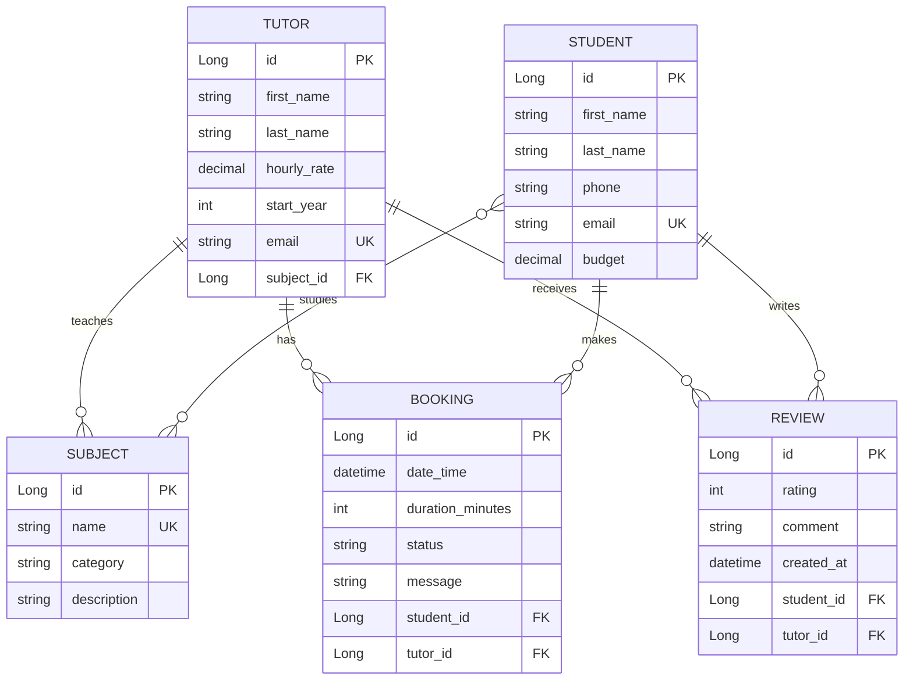

# ПЛАТФОРМА ПОИСКА И ВЫБОРА РЕПЕТИТОРОВ

## REST API проект на Java, фреймворк Spring, Maven.

Проект предоставляет набор готовых программных функций (API-запросов), с помощью которых можно управлять каталогом репетиторов. Например, фронтенд-разработчик или мобильное приложение может использовать этот API, чтобы:
1. Найти репетитора
2. Посмотреть карточку преподавателя
3. Добавить нового репетитора

---

**1ЛАБА:**
1. Создать Spring Boot приложение.
2. Реализовать REST API для одной ключевой сущности своей предметной области (domain).
3. Реализовать:
   - GET endpoint с @RequestParam
   - GET endpoint с @PathVariable
4. Реализовать слои: Controller → Service → Repository.
5. Реализовать DTO и mapper между Entity и API-ответом.
6. Настроить Checkstyle и привести код к стилю.

---

**2ЛАБА:**
1. Подключить реляционную БД к проекту.
2. В модели данных реализовать минимум 5 сущностей:
   - минимум одну связь OneToMany
   - минимум одну связь ManyToMany
3. Реализовать CRUD операции.
4. Настроить и обосновать использование CascadeType и FetchType.
5. Продемонстрировать проблему N+1 и решить её через @EntityGraph или fetch join.
6. Реализовать метод, сохраняющий несколько связанных сущностей. Продемонстрировать частичное сохранение данных без @Transactional и полное откатывание операции с @Transactional при возникновении ошибки.
7. Нарисовать ER-диаграмму с указанием PK/FK и связей.

---

**3ЛАБА:**
1. Реализовать сложный GET-запрос с фильтрацией по вложенной сущности с использованием @Query (JPQL).
2. Реализовать аналогичный запрос через native query.
3. Добавить пагинацию (Pageable).
4. Реализовать in-memory индекс на основе HashMap<K, V> для ранее запрошенных данных. Ключ должен формироваться из параметров запроса (составной ключ). Обеспечить корректную работу индекса за счёт правильной реализации equals() и hashCode().
5. Реализовать инвалидацию индекса при изменении данных.

---

**4ЛАБА:**
1. Реализовать глобальную обработку ошибок через @ControllerAdvice.
2. Добавить валидацию входных данных через @Valid.
3. Реализовать единый формат ошибки для всех endpoint.
4. Настроить логирование через logback:
   - уровни логирования
   - ротация логов
5. Реализовать аспект (AOP) для логирования времени выполнения сервисных методов.
6. Подключить Swagger/OpenAPI с описанием endpoint и DTO.

---

**5ЛАБА:**
1. Реализовать bulk-операцию (POST со списком объектов), имеющую бизнес-смысл в рамках проекта.
2. Использовать Stream API и Optional в сервисном слое.
3. Обеспечить транзакционность bulk-операции. Продемонстрировать работу с/без @Transactional и показать разницу в состоянии БД.
4. Написать unit-тесты для сервисов (Mockito)

---

**Сонар**: https://sonarcloud.io/projects

**Swagger**: http://localhost:8080/swagger-ui/index.html

## ER-диаграмма

