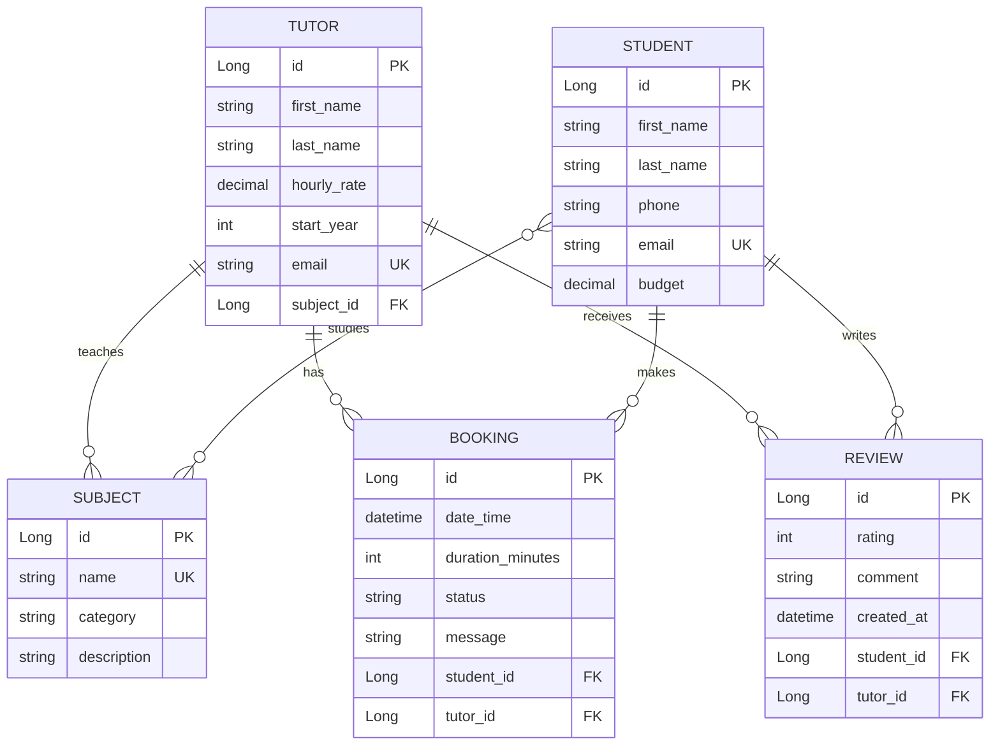

# ПЛАТФОРМА ПОИСКА И ВЫБОРА РЕПЕТИТОРОВ

## REST API проект на Java, фреймворк Spring, Maven.

Проект предоставляет набор готовых программных функций (API-запросов), с помощью которых можно управлять каталогом репетиторов. Например, фронтенд-разработчик или мобильное приложение может использовать этот API, чтобы:
1. Найти репетитора
2. Посмотреть карточку преподавателя
3. Добавить нового репетитора

---

1. Подключить реляционную БД к проекту.
2. В модели данных реализовать минимум 5 сущностей:
   - минимум одну связь OneToMany
   - минимум одну связь ManyToMany
3. Реализовать CRUD операции.
4. Настроить и обосновать использование CascadeType и FetchType.
5. Продемонстрировать проблему N+1 и решить её через @EntityGraph или fetch join.
6. Реализовать метод, сохраняющий несколько связанных сущностей. Продемонстрировать частичное сохранение данных без @Transactional и полное откатывание операции с @Transactional при возникновении ошибки.
7. Нарисовать ER-диаграмму с указанием PK/FK и связей.

---

**Сонар**: https://sonarcloud.io/projects

## ER-диаграмма
## ER-диаграмма

